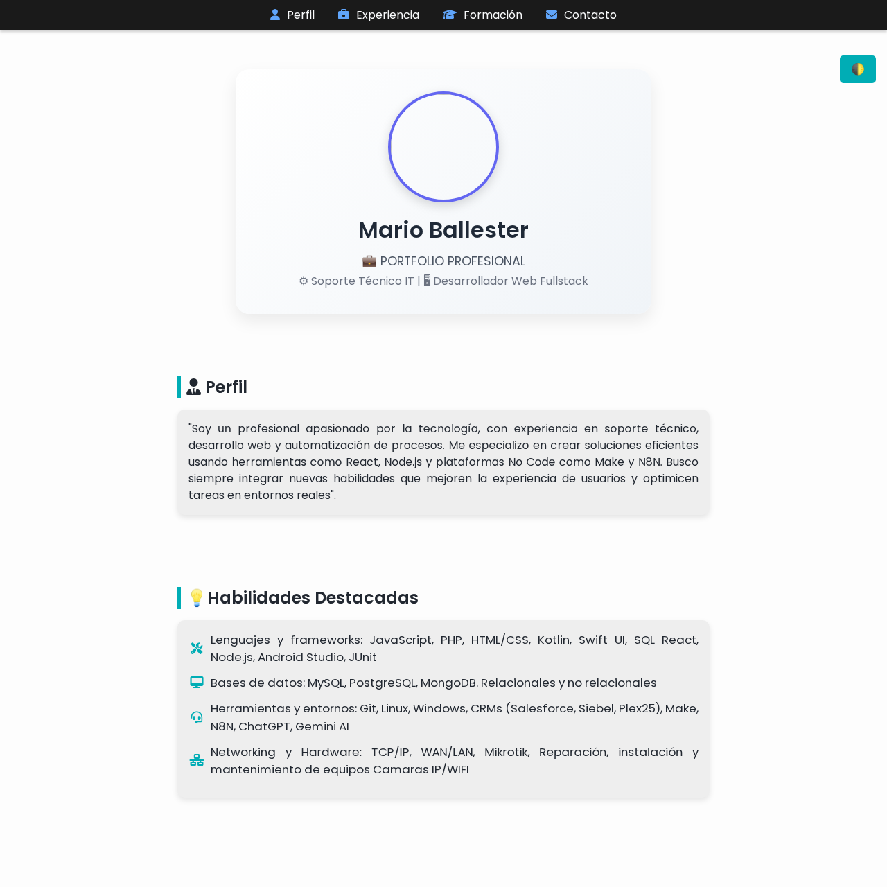
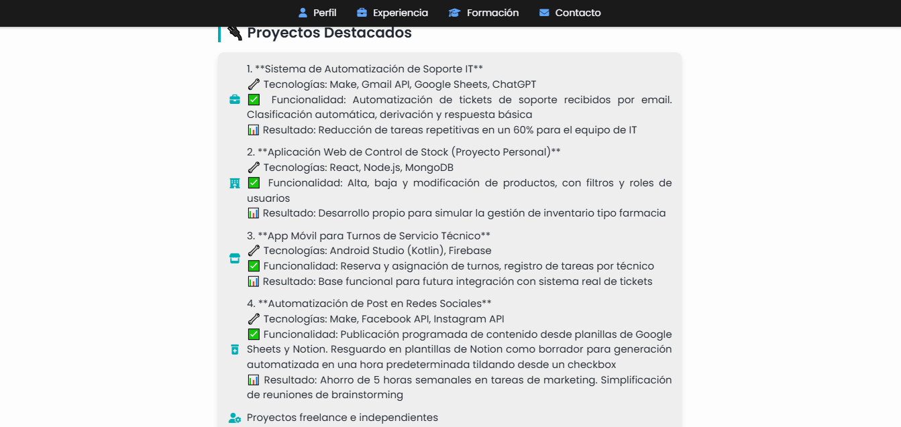
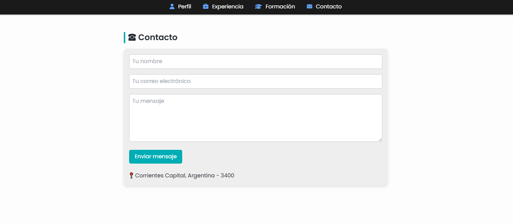

# 🌐 marioballester.dev


Portafolio web personal desarrollado por [Mario Ballester](https://github.com/marioaug), donde presento mis proyectos, certificaciones, y habilidades como desarrollador web.

## 🚀 Demo

🔗 [Visita el sitio en producción](https://marioballester.dev)

## ✨ Características

- Diseño moderno y responsive
- Animaciones suaves con TailwindCSS
- Sección de proyectos y certificados
- Contacto directo vía formulario o redes sociales
- Deploy con GitHub Pages / Vercel (según hosting)

## 🛠️ Tecnologías utilizadas

- ⚛️ React + Vite
- 💨 Tailwind CSS
- 🔀 React Router DOM
- ☁️ Vercel (o GitHub Pages) para despliegue
- 🧩 Otras librerías menores según sea el caso

## 📦 Instalación local

```bash
git clone https://github.com/marioaug/marioballester.dev.git
cd marioballester.dev
npm install
npm run dev
```

## 🧾 Estructura general
bash
Copiar
Editar
src/
├── assets/          # Imágenes y multimedia
├── components/      # Componentes reutilizables
├── pages/           # Secciones como Home, Proyectos, Contacto
├── data/            # Datos estáticos (JSON o JS)
└── App.jsx          # Rutas y estructura base

## 📸 Capturas
A continuación se muestran algunas vistas de [marioballester.dev](https://marioballester.dev):

### 🏠 Página principal



### 💼 Sección de Proyectos



### 📞 Contacto



> Generadas con [site-shot.dev](https://site-shot.dev)

## Demo animada
[Animación](assets/scrollpage.gif)

## 👨‍💻 Autor
Mario Ballester
Desarrollador web frontend apasionado por el diseño UX/UI y el código limpio.
🔗 marioballester.dev
🐙 @marioaug en GitHub

## 📄 Licencia
Este proyecto está bajo la licencia MIT - revisa el archivo LICENSE.
